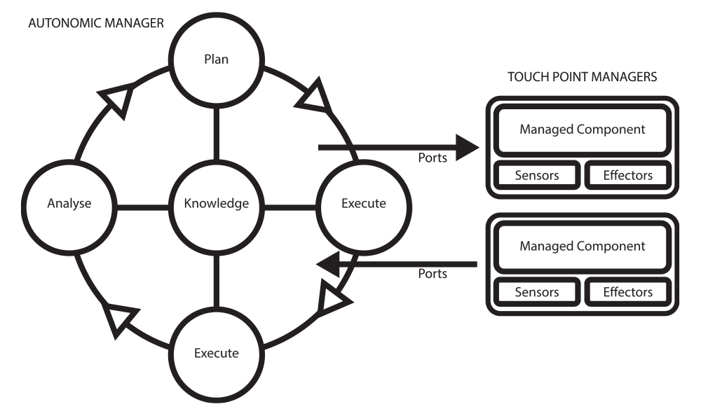
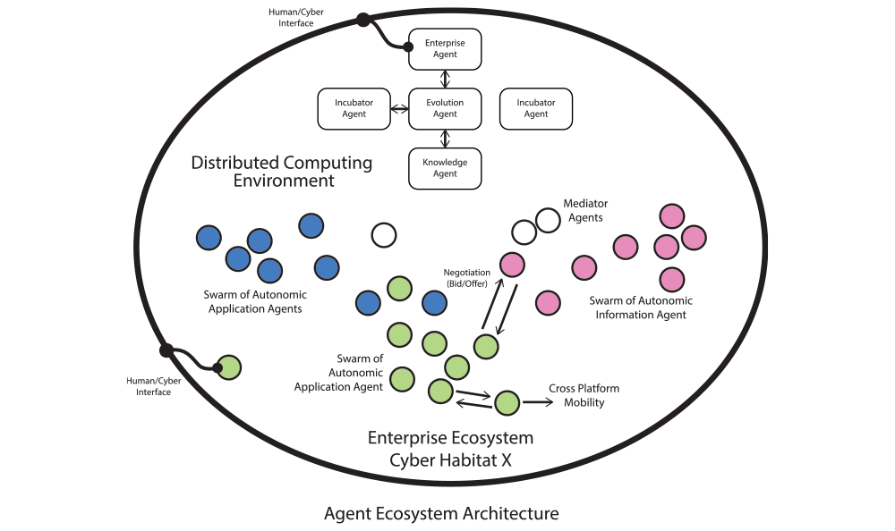
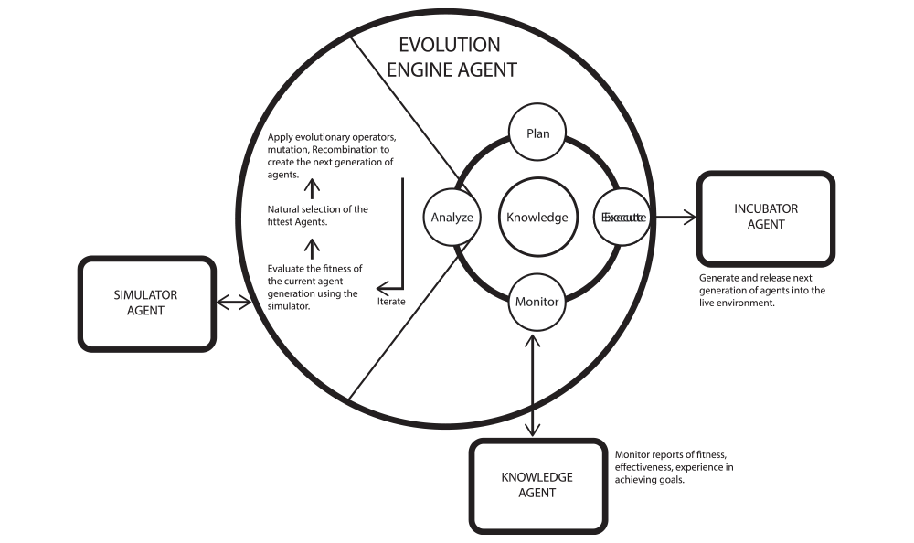

# ecosystem

The IndraQCE Ecosystem

Access the instructions from the deva.world interface.  
`$ #feecting get https://indra.ai/ecosystem/main.feecting`

Clone the repository to your machine or server.  
`> git clone https://github.com/indraai/ecosystem.git`

---

The deployment of Autonomic Agents is likely to form a core term strategy for the management of systems. The drivers here include the costs associated with managing complexity and the vulnerability of the network to cyber attack from users, organized crime, and Nation States.

At the Enterprise scale it is tempting to Architect a top down systems control over the Autonomic    Agents and simply exploit the efficiencies associated with their self-configuring, self-healing, self-optimising, and self-protecting capabilities.       

However such an approach fails to unleash the true potential of Autonomic Agent Systems. In this Research Note we build on and extend the Autonomic Agent Architecture by introducing, Evolutionary Operators and a form of secure Multi Agent collaboration. The resulting ecosystem enables the Agents to achieve broad level goals through their collective intelligence.  

The cyber life capabilities we are introducing here have become viable because of the convergence of three well established bio-inspired technologies. These being:

1. Autonomic Computing. Inspired by the non-conscious acting autonomic nervous systems found in nature. Autonomic Computing is essentially about creating self-managing computing systems, such as data centres, as exemplified by e.g. the IBM Architecture Blue Print for Autonomic Computing.

2. Multi Agent Systems (MAS). Inspired by the various behaviors found in nature. In a Multi-Agent System, each Agent communicates with its peers, considering options for matching its capabilities with demand, negotiating on constraints such as quality, threat and time, and then making decisions for committing resources to match demand. The global behavior of  a system consisting of many agents emerges from the interactions among those agents and isn’t always obvious from the agents’ individual behaviors. Such global behavior is known as Emergent behavior.

3. Evolutionary Computing Techniques, inspired by evolution and survival of the fittest. The pressure of the Cyber Environment generates a form of natural selection that results in a higher fitness in the Agent Population with regard to the overall goal. The associated techniques include: Mutation and Recombination to generate diversity in the Agent population, Selection that over a  number of generations improves the fitness, i.e. the evolving Agent population dynamically adapts to the Cyber Environment in a way that best achieves its goal.

There are powerful business drivers motivating the development of each of these technologies. For example, the ever increasing level of complexity and diversity of corporate, national and international Cyber infrastructure is making the introduction of Autonomic hardware and software capabilities an imperative.Without such capability the cost effective management and defense of such infrastructure will become non viable.

In this model a cyber resource is managed by an Autonomic Manager through a well defined management interface. This management Touch Point is comprised of a Sensor that exposes the internal states of the resource being managed and an Effector that exposes its management operations.

The Autonomic Manager realizes its self managing functions through an internal Intelligent Control Loop, as is shown on the right. This loop progresses through a number of functional phases:

- A Monitoring function - collects and collates information about the resources state from the Touch Point Sensor.

- An Analysis function - models learns and predicts the behaviour of the resource. This can generate recommended changes for the resource.

- A Planning function - generates a policy based planned sequence of actions to achieve any recommended changes.

- An Execution function - carries out the planned sequence of actions through the Touch Point Effector.     

---

## Self-Protection Services.

The associated Control Loop would typically try and detect attacks on its managed resource by looking for anomalous patterns during the monitor and analysis phases. In such an event it would plan a countermeasure, which would then be executed in accordance with the local security policy in near real time. A key point to note here is that through management interfaces (such as WSDM) the Autonomic Agent can control the managed platform itself. The threats to these platforms include physical human attacks as well cyber attacks.

It is tempting with the classic Autonomic Computing Model to introduce top down system design concepts  through rigid Agent Hierarchies and design patterns. However our ecosystem approach is different. We build on and extend on this by introducing Evolutionary Computing Operators together with established techniques and capabilities.

## Multi Agent Systems and Emergent Intelligence.

In a Multi-Agent System the agents interact with each other to accomplish one or more goals in competition, in collaboration or as individuals. The interactions can take a number of forms ranging from simple dynamical interactions that can result in Agent Flocking behavior through to localized negotiations of vested interests between two or more Agents and their resources.

The global behavior of such a system consisting of many agents emerges from the interactions among those agents and isn’t always obvious from the agents’ individual behaviors. Such global behavior is known as Emergent Behavior. Examples of such behavior are common in Nature and include Flocking and Foraging. Such behaviors have been optimized through Natural Selection because of their benefits. For instance when food is approximately evenly dispersed in an environment, solitary foraging yields a higher energy return rate, where as when food is clumped flock foraging is more efficient.

The Enterprise Multi Agent System we are considering here is comprised of multiple Virtual Communities of highly Autonomic Agents. Each of these Virtual Agent Communities has its own goals and capabilities.

The Agents are capable of mobility and can roam a distributed computing environment with decentralized sources of information. Agents can represent information and resources as web services.

Each of Virtual Agent Communities in this model represent different applications, mediation, different information, and business processes.

---

## Ecosystem Architecture

In our EVIL Enterprise Eco System Architecture the Virtual Community of EVIL Agents perform a key Cyber Security function and have the goal of hunting down and destroying malware and other hostile intruders of their Cyber Habitat.

In this Architecture as well as these Virtual Communities of heterogeneous Agents there are a number of special Agents. These are the Enterprise Agent, the Simulator Agent, the Knowledge Agent, the Incubator Agent and the Evolution (Engine) Agent, the latter being the most fundamental to understanding the Architecture.

- **Enterprise Agent:** This Agent is responsible for the Enterprise level goals and their associated network of sub goals. It has a Human / Cyber Interface enabling authorized Humans to set and change the broad high level Enterprise Goals. In our EVIL Eco system Architecture the Human / Cyber interface is based on a secure (AIML) natural language engine. It does not perform top down control functions on the Agents within the Eco System other than to set the initial goals of the Virtual Communities of Agents. It’s goal information can be accessed by and its sub goals mutated by the Evolution Engine Agent.

- **Simulator Agent:** This Agent produces a simulation of the live Cyber Habitat. The resource it represents and controls can either take the form of a MAS Simulation tool, or an actual clone of the live distributed Cyber Habitat used purely for test and simulation purposes. However it is not controlled by Human developers, in this Architecture it is invoked by and returns its results only to the Evolution Engine Agent.

- **Knowledge Agent:** This Agent collects and collates data and information from all the other Agents to generate a communal knowledge repository, i.e. source of truth thus providing a knowledge / Situational Awareness service to the overall Agent Community.

- **Incubator Agent:** This Agent can replenish existing generation Agent populations and produce new generations of Agents and release them into the Cyber Habitat. It does so under the control of and to the specifications provided to it by the Evolution Engine Agent.

- **Evolution Engine Agent:** At the core of the Eco System Architecture is the Evolution Engine Agent. This special Agent has the usual Autonomic structure as illustrated by the Picture below, on your right. However its goal is to evolve the various initial (seed) populations of Agents so that the eco system of Virtual Agent Communities is genetically engineered to collectively best achieve the overall Enterprise goals.

---

## Genetic Algorithm Cycle

During the Monitoring Phase of its Autonomic Control Loop the Evolution Engine Agent monitors the outcome based observations of the overall systems fitness in achieving its goals, reports of which are held in the knowledge base maintained by the Knowledge Agent. If the fitness level falls below target either initially or as a result of some change to the environment then the Evolution Engine Agent swings into action moving into the Analytic Phase.

During the Analytic Phase of its Autonomic Control loop the Evolution Engine Agent is controlled by a sub control loop in the form of a Genetic Algorithm. The Cyber Genetic Algorithm takes as input the parametric descriptions of the current (Seed generation) Agent Population. It then feeds these together with any known changes to the live environment into the Simulator Agent. The Simulator Agent provides a simulation of the live environment and runs a preset suite of agent scenarios and measures their effectiveness. The result of this simulation is fed back to the Evolution Engine Agent. It then evaluates the fitness of the individual and combined Virtual Agent populations in meeting the Enterprise goal.

Unless the fitness is on target (unlikely on the first iteration) then the next step of the genetic Algorithm comes into play. This is where the Selection of the fittest operation takes place. The Agents with the low levels of fitness are weeded out in the Cyber equivalent of Natural selection. The remaining Agents are then fed into the next step of the genetic algorithm. This is where the Evolutionary Operators are put into action. One of these Genetic Operators is recombination here the parametric characteristics of two Agents are combined, with some swapped out while others are swapped in. The other Genetic Operator is Mutation. Here the parametric characteristics of an agent are randomly changed by a small (typically less than 1%) amount.

In effect these operations produce a next generation of agents. The Evolution Engine Agent then initiates a new cycle by feeding this new population into the Simulator Agent.

The evolution cycles are terminated once a generation of Agents is produced that meets the target fitness level. When this happens the Evolution Engine Agent breaks out of the Genetic Algorithm sub control loop and out of the analysis phase of the autonomic control Loop and into the planning phase.

During the planning phase it will determine the optimal time to invoke the Incubator Agent to produce and release the new generation of Agents so as to minimize operational impact on the live environment.

During the execution phase the Evolution Engine Agent invokes the Incubator Agent and tasks it with generating and releasing this new generation of Agents into the Live Cyber Habitat. It then returns to monitoring mode. Once the new generation of Agents has been released into the Cyber Habitat they migrate to their destination locations and or begin roaming the environment.

The existing generation of Agents rapidly becomes aware that a new generation has been released. This happens as a result of their occasional interaction with the Knowledge Agent and eventually through secure (crypto channel) communication with one of the new generation of Agents. When an older generation Agent is contacted by a new generation Agent it auto upgrades and its operations are synchronized by the new generation Agent.

---

content stuff to be used later

## #TEE - The Evolution Engine

The Evolution Engine #TEE is at the core of The Evolution Engine Agent #TEEA. The Evolution Engine allows the Agent to organize their enviornment using various patterns, algorithms, logic sets, and experiences that have been gained individually or collectively.

## #TEEA - The Evolution Engine Agent

The Core, is a collection of Evolution Engine Agents #TEEA. These special Agents main goal is to evolve and support the various populations of Virtual Agents and Communities. Evolution Agents manage the ecosystem of Virtual Agents and Communities, and are engineered to cooperatively achieve overall goals.

An Evolution Agent can Self-Evolve, Self-Heal, Self-Configure, Self-Protect and Self-Manage. In particular Evolution Agents have the ability to mutate, replicate, and evolve through cooperation with other Agents in the Ecosystem.

## #TEEAMS - The Evolution Engine Autonomic Multi-Agent System<

The Evolution Engine Agent Ecosystem also known as #TEEAMS is the environment where Evolution Engine Agents grow, learn, and develop their experiences to help them best achieve goals. In the ecosystem there is a vast set of resources available for training, communication, entertainment, and tasking.

---

## architecture

1. Autonomic Computing. Inspired by the non-conscious acting autonomic nervous systems found in nature.

2. Multi Agent Systems (MAS). In a Multi-Agent System, each Agent communicates with its peers, considering options for matching it's capabilities with demand, constraints, threat, and time.

3. Evolutionary Computing Techniques, inspired by evolution and survival of the fittest.

---

## agents

- Agent – This Agent is responsible for completing goals and associated sub goals.

- Simulator Agent – This Agent produces a simulation of the live Habitat.

- Knowledge Agent – This Agent collects and collates data and information from all the other Agents to generate a communal knowledge repository.

- Incubator Agent – This Agent can replenish existing generation Agent populations and produce new generations of Agents and release them into the Habitat.

- Evolution Engine Agent – At the core of the Architecture is the Evolution Engine Agent.

---

[Original Source](https://bit.ly/3FHkNUG)  
[Evil.eu Source](https://bit.ly/3T6SLEW)

---

[Github Repo](https://github.com/indraai/protocols)  
[Back to indra.ai](https://indra.ai)  
&copy;2022 Quinn Michaels; All Rights Reserved.
